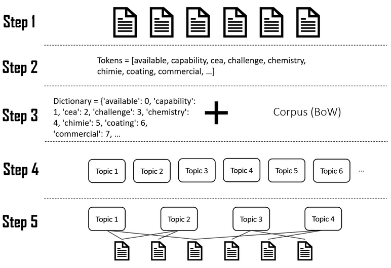
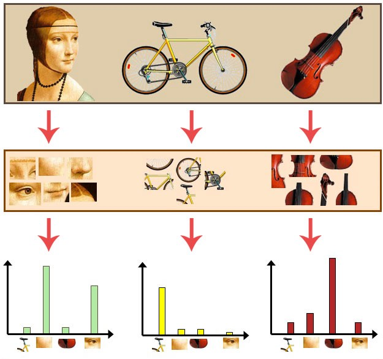

# Topic Modelling & Image Classification ("Améliorez le produit IA de votre start-up")

[This project is part of the AI Engineer cursus on OpenClassrooms]

We are provided with a dataset from [Yelp](https://www.yelp.com/dataset) containing:
- information about **150.346 businesses** of any kind. 
- **6.990.280 reviews** wrote by **1.987.897 users** about those businesses.
- **200 100 pictures** of foods, drinks, interiors, exteriors and menus taken by the users.

> The purpose of this project is to train on the 3 following features:
> - **detect topics of dissatisfaction** in the comments published on the platform.
> - **automatically label the photos** posted on the platform.
> - **collect new reviews** using the Yelp API.

1. At first, we will conduce an EDA for the Topic Modelling and try LDA and NMF modelling (01_Topic_Modelling.ipynb)

2. Then we will conduce an EDA for the Image Classification problem and optionnaly try to implement a model (04_Image_Classification.ipynb)

3. After that, will develop a python script to gather new reviews from the Yelp API (02_API_Scrapping.py)
4. And finally, we will procude a custum dashbord to present and try the various solutions (03_Streamlit.py)

## Running the notebooks online

As the notebooks use hyperlinks for the navigation, and because this doesn't work on GitHub, they are also avaible on [nbviewer.org](https://nbviewer.org/github/Valkea/OC_AI_06/tree/main/) for convenience.

## Running the notebook locally

In order to use this project locally, you will need to have Python and Jupyter notebook installed.
Once done, we can set the environment by using the following commands:

### First, 
let's duplicate the project github repository

```bash
>>> git clone https://github.com/Valkea/OC_AI_06
>>> cd OC_AI_06
```

### Secondly,
let's download the [datasets](https://www.yelp.com/dataset) and put them in the 'data' folder:
> data/yelp_dataset/yelp_academic_dataset_business.json
> data/yelp_dataset/yelp_academic_dataset_review.json
> data/yelp_photos/photos.json'
> data/yelp_photos/photos/[the photos].jpg

### Thirdly,
let's create a virtual environment and install the required Python libraries

(Linux or Mac)
```bash
>>> python3 -m venv venvP6
>>> source venvP6/bin/activate
>>> pip install -r requirements.txt
```

(Windows):
```bash
>>> py -m venv venvP6
>>> .\venvP6\Scripts\activate
>>> py -m pip install -r requirements.txt
```

### Finally,
let's configure and run the virtual environment for Jupyter notebook


#### Install jupyter kernel for the virtual environment using the following command:

```bash
>>> pip install ipykernel
>>> python -m ipykernel install --user --name=venvP6
```

#### Install specific tools that aren't installed using the requirements.txt file

REQUIRED: let's install the spacy model used in this project
```bash
>>> python -m spacy download en_core_web_sm
```

OPTIONAL: if you encounter a problem after the Streamlit installation, the following line might solve it:
```bash
>>> echo fs.inotify.max_user_watches=524288 | sudo tee /etc/sysctl.d/40-max-user-watches.conf && sudo sysctl --system
```

OPTIONAL: if tf-lite is not correctly installed, it might be a good idea to try the following line:
```bash
>>> pip install --extra-index-url https://google-coral.github.io/py-repo/ tflite_runtime
```

#### Select the installed kernel

In order to run the various notebooks, you will need to use the virtual environnement created above.
So once the notebooks are opened (see below), prior to running it, follow this step:


#### Run the jupyter notebooks

1. in order to see the *Topic Modelling* notebook, run:
```bash
>>> jupyter notebook 01_Topic_Modelling.ipynb
```

2. then, to see the *Image Classification* notebook, use the following command:
```bash
>>> jupyter notebook 02_Image_Classification.ipynb
```

3. and after that, one can explore the *interactive Streamlit app* using:
```bash
>>> streamlit run 03_Streamlit.py
```

3. finally, one can *collect new reviews* using the following script:
```bash
>>> python 02_API_Scrapping.py # this will gather "200" new reviews from "France" and save them to "data/api_export.csv"
or
>>> python 02_API_Scrapping.py --help # this will return the full list of available parameters
or
>>> python 02_API_Scrapping.py -n=100 -l=Chicago -p=data/my_file.csv -v=3 # This is an example
```

#### Uninstalling the venv kernel
Once done with the project, the kernel can be listed and removed using the following commands:

```bash
>>> jupyter kernelspec list
>>> jupyter kernelspec uninstall venvP6
```

